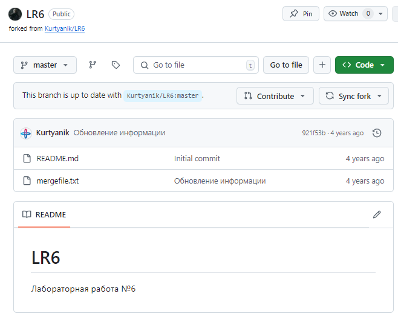
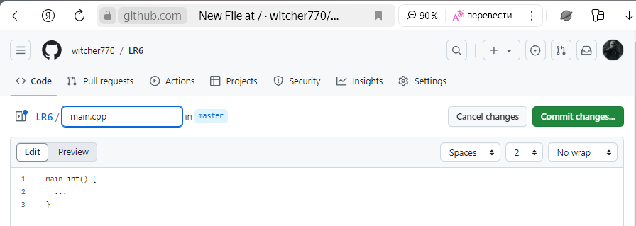
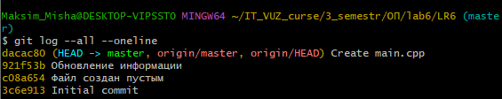
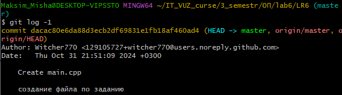

# LR6
Лабораторная работа №6

# Отчет по работе с Git

## 1. Создание форка
*Скриншот с созданием форка*  


## 2. Установка Git
*Уже скачан на ПК*  

## 3. Изменение имени пользователя
Команда для изменения имени пользователя:

```bash
$ git config --global user.name "4317 Уряшов М.В."
```

## 4. Клонирование репозитория

```bash
$ git clone https://github.com/witcher770/LR6
```

## 5. Добавление нового файла
*Скриншет с добавлением нового файла*


## 6. Добавление изменений в локальный репозиторий

```bash
$ git pull
```

## 7. Получение данных для каждой из веток

```bash
$ git log --all –oneline
```

*Результат работы команды*



## 8. Просмотр последних изменений

```bash
$ git log -1
```

*Результат работы команды*



